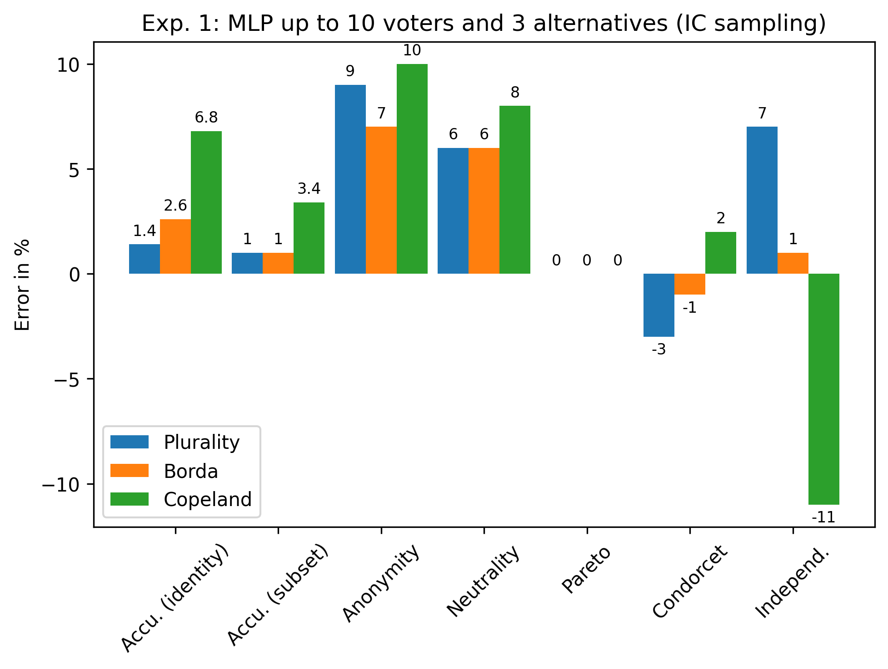

# Learning How to Vote With Principles

This repository contains the code for the paper 

> _Learning How to Vote With Principles: Axiomatic Insights Into the Collective Decisions of Neural Networks_
>  
>  Levin Hornischer, Zoi Terzopoulou
>  
> Forthcoming in the [Journal of Artificial Intelligence Research (JAIR)](https://www.jair.org/index.php/jair/index)
> 
> Arxiv version: [https://arxiv.org/abs/2410.16170](https://arxiv.org/abs/2410.16170)


## Setup

The required environments to run the Python code are described in the file `ax_deep_voting.yml`. To create the folder (with subfolders) to store the results when running the experiments, execute the following command (on linux)

```
mkdir -p results/{exp1/{CNN,Evol,Fixed,MLP,MLP_large,MLP_small,plots,WEC},exp2/{CNN,MLP,plots,WEC},exp3/{CNN,MLP,plots,WEC}}
```

or create this folder structure manually in the directory in which you store the code.

The files `exp1.py`, `exp2.py`, and `exp3.py` contain the functions to run experiments 1, 2, and 3 of the paper, respectively. The remaining files contain additional code for those experiments. 

## Quick start examples

### Experiment 1

In the first experiment, we train a neural network to learn an existing voting rule. We consider the three standard voting rules Plurality, Borda, and Copeland. Then we report the accuracy and axiom satisfaction of the neural network in comparison to each of those rules. (The run time for this toy example on a regular laptop should be in the order of 2 minutes.)

```python
import exp1
import plot_and_visual

file_locations = {}
for rule_name in ['Plurality', 'Borda', 'Copeland']:
    print(f'Next: MLP with IC and rule {rule_name}') 
    location = exp1.experiment1(
        architecture = 'MLP',
        rule_names = [rule_name],
        max_num_voters = 10,
        max_num_alternatives = 3,
        election_sampling = {'probmodel':'IC'},
        num_gradient_steps = int(200),
        eval_dataset_size = int(500),
        sample_size_applicable = 100,
        sample_size_maximal = int(1e6),
        comparison_rules = ['Plurality', 'Borda', 'Copeland'],
    )
    file_locations[rule_name] = location

plot_and_visual.plot_exp1(
    file_plurality = file_locations['Plurality'],
    file_borda = file_locations['Borda'],
    file_copeland = file_locations['Copeland'],
)
```

The resulting plot should, up to some stochasticity, look like this:




### Experiment 3

In the third experiment, we consider the unsupervised learning task in which the neural network only optimizes axiom satisfaction but does not see data from an existing rule. (The run time for this toy example on a regular laptop should be in the order of 2 minutes.)

```python
import exp3

location_model = exp3.experiment3(
    architecture='WEC',
    max_num_voters=10,
    max_num_alternatives=3,
    election_sampling={'probmodel':'IC'},
    num_gradient_steps=500,
    report_intervals=1000,
    eval_dataset_size=500,
    model_to_rule = {
        'plain':True, 
        'neut-averaged':None, 
        'neut-anon-averaged':False # For WEC not needed, anonymous by design
    },
    sample_size_applicable=100,
    sample_size_maximal=int(1e5),
    architecture_parameters = {
        'we_corpus_size':int(1e3),
        'we_size':100, 
        'we_window':5, 
        'we_algorithm':1,
    },
    axioms_check_model= [
        'Anonymity', 
        'Neutrality', 
        'Condorcet', 
        'Pareto', 
        'Independence'
    ],
    axioms_check_rule=[], 
    axiom_opt={
        'No_winner': {'weight':10, 'period':'always'},
        'All_winners':None,
        'Inadmissible':None,
        'Resoluteness':None,
        'Parity':None,  
        'Anonymity':None,  
        'Neutrality':None, 
        'Condorcet1':{'weight':2, 'period':'always'}, 
        'Condorcet2':None,         
        'Pareto1':None, 
        'Pareto2':{'weight':1, 'period':'always'},         
        'Independence':None  
        },
    comp_rules_axioms=[],  
    comp_rules_similarity = [],
    distance='KLD',
)
```

To compare the axiom satisfaction of the rule that is found by the neural network to existing voting rule, we now also compute the axiom satisfaction of the latter. (The run time on a regular laptop should be in the order of 1 minute.)

```python
import exp3
import utils

location_rules = exp3.experiment3(
    architecture='MLP', # dummy choice since no training
    max_num_voters=10,
    max_num_alternatives=3,
    election_sampling={'probmodel':'IC'},
    num_gradient_steps=0, # no training
    report_intervals=0,
    eval_dataset_size=500,
    model_to_rule = {
        'plain':False, 
        'neut-averaged':False, 
        'neut-anon-averaged':False 
    },
    sample_size_applicable=100,
    sample_size_maximal=int(1e5),
    architecture_parameters = None,
    axioms_check_model= [],
    axioms_check_rule=list(utils.dict_axioms_rules.keys()),
    axiom_opt={
        'No_winner':None,
        'All_winners':None,
        'Inadmissible':None,
        'Resoluteness':None,
        'Anonymity':None, 
        'Neutrality':None, 
        'Condorcet1':None, 
        'Condorcet2':None,         
        'Pareto1':None, 
        'Pareto2':None,         
        'Independence':None},
    comp_rules_axioms=list(utils.dict_rules_all_fast.keys()),
    comp_rules_similarity=[],
)
```

Finally, we plot a table (formatted in LaTeX) to compare the results.  

```python
import plot_and_visual

plot_and_visual.exp3_table(
    file_rules = location_rules,
    file_WEC = location_model,
)
```

Up to some stochasticity, the result should look like this:

|                     | Anon. | Neut. | Condorcet | Pareto | Indep. | Avg.|
|---                  | ---   | ---   | ---       | ---    | ---    | --- |
|Plurality            | 100   | 100   | 93        | 100    | 67     | 92  |
|Borda                | 100   | 100   | 99        | 100    | 72     | 94.2|
|Anti-Plurality       | 100   | 100   | 84        | 100    | 50     | 86.8|
|Copeland             | 100   | 100   | 100       | 100    | 58     | 91.6|
|Llull                | 100   | 100   | 100       | 100    | 59     | 91.8|
|Uncovered Set        | 100   | 100   | 100       | 100    | 61     | 92.2|
|Top Cycle            | 100   | 100   | 100       | 100    | 64     | 92.8|
|Banks                | 100   | 100   | 100       | 100    | 59     | 91.8|
|Stable Voting        | 100   | 100   | 100       | 100    | 66     | 93.2|
|Blacks               | 100   | 100   | 100       | 100    | 73     | 94.6|
|Instant Runoff TB    | 100   | 100   | 100       | 100    | 70     | 94  |
|PluralityWRunoff PUT | 100   | 100   | 97        | 100    | 66     | 92.6|
|Coombs               | 100   | 100   | 100       | 100    | 69     | 93.8|
|Baldwin              | 100   | 100   | 100       | 100    | 69     | 93.8|
|Weak Nanson          | 100   | 100   | 100       | 100    | 69     | 93.8|
|Kemeny-Young         | 100   | 100   | 100       | 100    | 64     | 92.8|
|WEC p (NW, C, P)     | 100   |  76   | 93        | 100    | 66     | 87  |
|WEC n (NW, C, P)     | 100   | 100   | 96        | 100    | 70     | 93.2|
